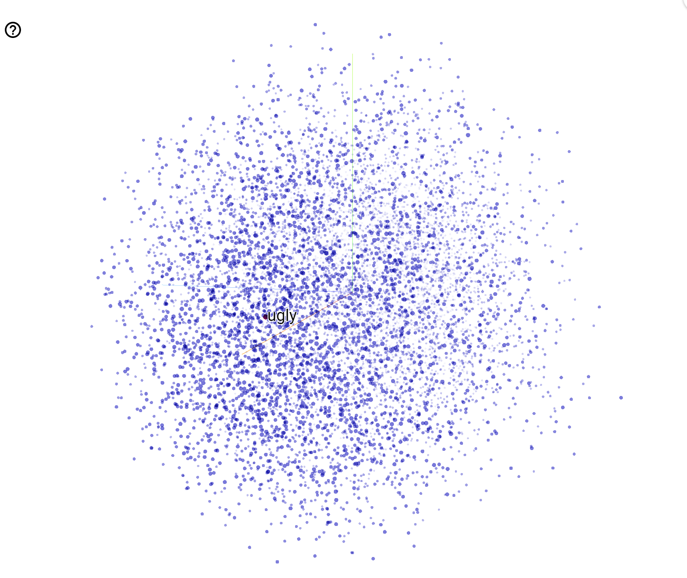

# IMDB-Movie-Review-Simple-NLP-model
Sentiment analysis of large Movie Review dataset from Tensorflow and apply Tokenization and Pad Sequences(NLP techniques) in Datasets. Build a simple DNN model for testing sentiment of different words. 

